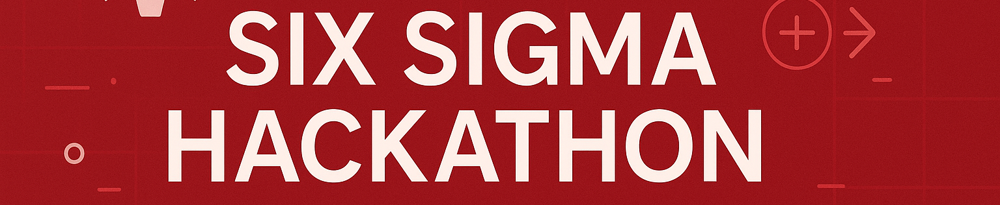

---

# README `docs`

This folder contains explainers and tutorials for the Six Sigma Hackathon.

| Doc | What it is |
|---|---|
| [`schedule.md`](schedule.md) | run of show — on-campus 24-hour and 7-day DL tracks |
| [`criteria.md`](criteria.md) | the scoring rubric (0-100) |
| [`prompts.md`](prompts.md) | prompts — revealed at the start of the event |
| [`resources.md`](resources.md) | tutorials, textbook links, template pointers |
| [`agents.md`](agents.md) | popular AI coding agents, and how to pick one |
| [`tools.md`](tools.md) | Wispr Flow (voice to your agent) and Open Design |
| [`mentors.md`](mentors.md) | mentor signup |
| [`github_pat.md`](github_pat.md) | GitHub personal access tokens |
| [`icons.md`](icons.md) | emoji/icons for your README |

Your team's SPEC and CONTRACT (pre-filled, at the repo root):
[`SPEC.md`](../SPEC.md) and [`CONTRACT.yaml`](../CONTRACT.yaml); blank copies in
[`.claude/templates/`](../.claude/templates/README.md). Starter templates:
[`demos/`](../demos/README.md). Deploy workflows:
[`.claude/skills/connect-publish/`](../.claude/skills/connect-publish/README.md).

For this repository's table of contents, see the homepage:

[https://github.com/timothyfraser/sixsigmahackathon](https://github.com/timothyfraser/sixsigmahackathon/tree/main)

---

