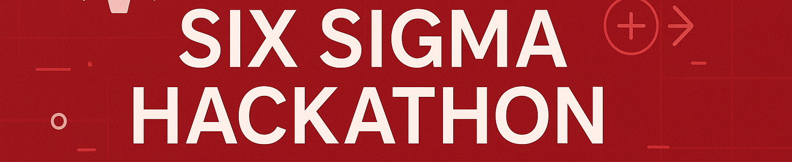

---

# 🏆  Evaluation Criteria

All projects will receive a 🏅 score of 0 to 100 from the event staff, based on the following criteria:

---

#### 🧱 Tool Implementation (50 pts)
How well does this tool perform its intended function?

- (25 pts) 🧰 An effective, working tool - eg. does it run?
- (25 pts) 📊 Performs valid analyses relevant to quality control in R or Python --> eg. does it make sense?

#### 🧭 Tool Design (15 pts)
How well does this tool meet the needs of stakeholders?

- (5 pts) 🔍 Scope of tool/product closely matches one of the prompts.
- (5 pts) 💡 The product should have a clear user and use case in mind.
- (5 pts) 🔢 Requires a minimal, reasonable number of inputs or requirements from the user/customer. For example, requiring the customer to know traits and values about their product that they are unlikely to be able to measure is not helpful and should be avoided.

#### 📑 Tool Documentation (35 pts)
How polished and ready is this tool for public use?

- (10 pts) 2-3 accurate, working test datasets
- (10 pts) A clear demonstration of the tool, using the test datasets.
- (5 pts) Excellent, easy-to-follow documentation for the tool - how does each function work, what are the inputs, parameters, etc.
- (5 pts) A codebook and README for your datasets, describing what each file and variable means, and any other background information necessary for collecting this data.
- (5 pts) Fully reproducible code, posted publicly to a Github Repository,

---

 
